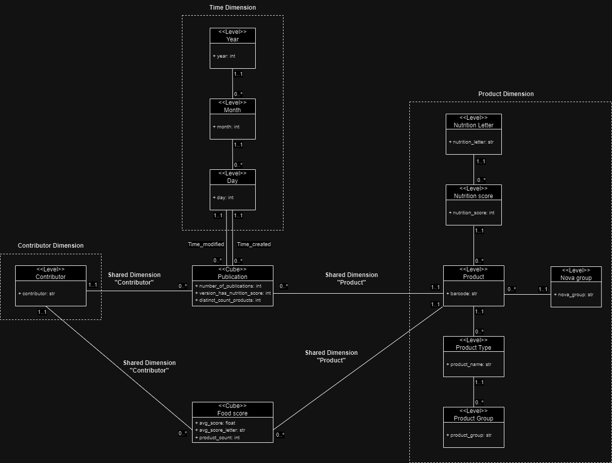
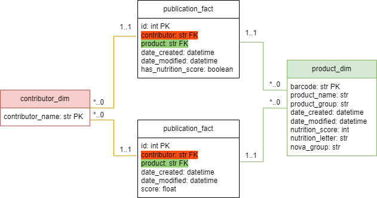
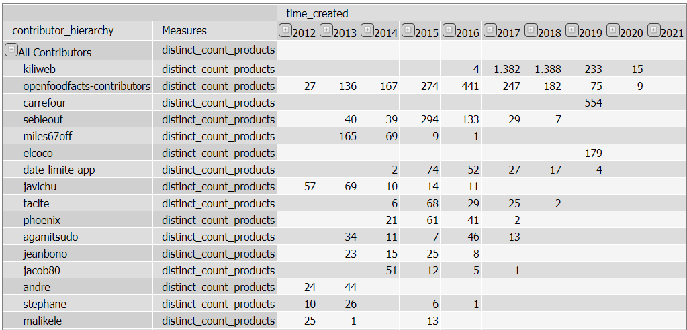
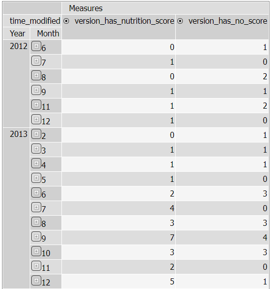
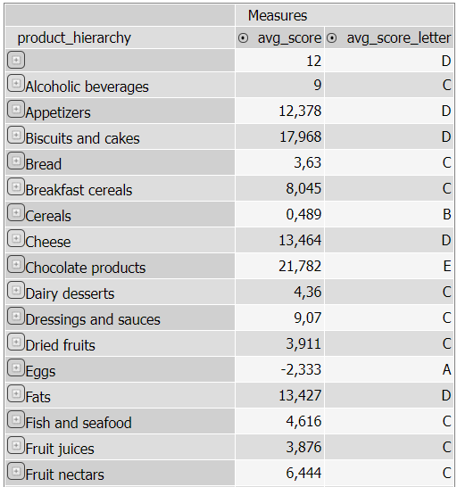
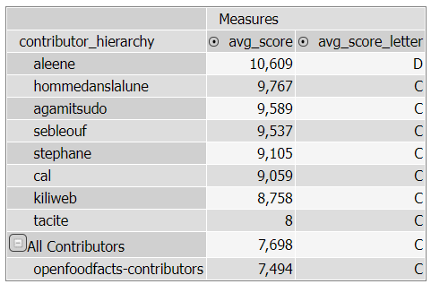

# OFF_Vitali_Heinen - Data Warehouses Open Food Facts Project A.y. 2023/24

## Introduction
The goal of the project is to understand and put in practice the workflow of an ETL process.
The steps of the worflow are the following:
1. Extract data from external sources and store it in a Data Warehouse: our Data Warehouse is given by the 3 databases OFF_2_contributeur, OFF_2_pnns, and OFF_2_version_produit. The data is available on phpMyAdmin.
2. Design the UML schema of the multidimensional model we adopted.
3. Write the XML code that represents the multidimensional Mondrian schema chosen to represent our data. The code is written using the Schema Workbench interface.
4. Define the relational model of the supporting database.
5. Write the SQL script to create the supporting database, i.e. our Data Mart.
6. Transform the data to fill the dimensional and fact tables with Kettle or SQL.
7. Write the MDX code for the selected queries on Pentaho Server.
8. Run the queries using JPivot on Pentaho Server and analyze the result.

The original database is the Open Food Facts database which contains records posted by contributors regarding food products sold in supermarkets. Products are associated with categories and also with different nutritional scores. The products can have multiple versions, i.e. contributors can update over time the data regarding one product. In this case, we have multiple records related to the same product with different modification dates. Each record contains the creation date of the first record related to that product, and the modification date related to that specific record.

The project description required us to design the multidimensional schema of two Mondrian cubes and then to run queries on those cubes. We had to run two predesigned queries on that schema.
Then, we were required to design and run some additional queries of our choice on a newly designed cube.

## Files contained in the GIT repository
In this GIT repository you will find the following files:
- UML Schema
- XML code of the Mondrian schema
- Relational model of the supporting database
- SQL code to generate the supporting database
- Kettle/SQL file to fill the data into the dimensional and fact tables
- MDX code of the performed queries.

## Description of the UML diagram
### First cube: Publications 

The idea of this cube is to contain all the versions for each product in the data warehouse and perform analysis on them. It is composed of:
- Product shared dimension.
- Contributor shared dimension.
  
And three different measures used to perform the required queries.
The cube has also two degraded time dimensions. A view is used to take the year, month and day from the creation and modification datetime column.
On this cube are perfomed the two required queries (1 and 2).

### Second cube: Products 

This cube is thought to contain only the last version for all the products that have a nutrition score. This decision since we found meaningful to perform queries related to the scores and perform analysis of contributors and groups of products. In this case the cube has two shared dimensions:
- Product shared dimension.
- Contributor shared dimension.

And also two measures and a calculated member. The latter is a formula to map the average nutrition scores to the relative nutrition letter.
On this cube are performed queries 3 and 4.

### Shared dimension: Product 

This is the product dimension where all the information about the product are stored. It is composed of three different hierarchies:
1. Product hierarchy: it contains all the information about the product name, product group and barcode.
2. Nova hierarchy: it contains all the information about the nova group.
3. Nutrition hierarchy: it contains all the information related to nutrition scores and letters.

### Shared dimension: Contributor 

This is the contributor hierarchy where all the information about the contributors are stored. In this case, there is also stored the latest contribution date that could be useful for some analytics.

## Description of the Relational model
In the image below you can find the relational model. The only non degraded dimensions are `product_dim` (green) and `contributor_dim` (orange), so that why we only have two dimension table. Both fact table have a non-nullable Many-To-One relation to these dimensions, as illustrated in the diagram.

## Description of data transformation step
Instead of using Kettle, we've decided to fill all tables using raw SQL `insert into` statements. The data transformation part starts in at [line 52](https://github.com/niekheinen/EDD_project/blob/main/initialize_database.sql#L52) in the `initialize_database.sql` file. Below we will elaborate the steps taken to properly initliaze the data for every table

#### `product_dim`
To fill the product table, we need the latest instance of every product. To do so, we first created a subquery that gets the latest modification date for every product. We then do an inner join on the original product version table (i.e. `OFF_2_version_produit`) to select the latest version. After that we simple select the attributes we want and give them some better names.

#### `contributor_dim`
Filling this dimension is rather simple, as we just need all unique values of `OFF_2_version_produit.pseudo`, we've decided to rename this value to `contributor_name` for clarity.

#### `publication_facts`
Filling this fact table is rather simple, as it it's basically modeled after the original product version table (i.e. `OFF_2_version_produit`). We simply do a select on that table, and apply our renaming. The only extra column we added is `has_nutrition_score`, this columns contains a boolean value (`0` for false, `1` for true) that indicates wheter or not this specific column has a nutrition score defined.

#### `product_facts`
For this fact table we need the latest version of the product, for which we can use the previously created `product_dim`, and we need to append it with the latest contributor of this product. We use a similar technique as used in filling the data for `product_dim`.

## Queries performed
In this section, we describe and motivate the queries performed on the cubes, and we include screenshots of their outputs.

1. First assigned query: **Number of products per contributor type (on rows) and year of creation (on columns).** This query is useful since it displays the number of product created by each contributor for each year. This allows us to examine how contributions are spread over time, as well as who the most active contributors are and the development of their participation in the database over time, such as whether contributors tend to grow or reduce their provided contributions over time. The query is performed over the PublicationsCube and the following is a snippet of the results. 

2. Second predesigned query: **Number of versions per year/month of version (on rows) having/not having Nutri-Score respectively (on columns).** This query is useful for determining how many products include Nutri-Score values and determining if the number of accessible scores is rising or decreasing over time. The query is performed over the PublicationsCube and the following is a snippet of the results.

3. First additional query: **Average nutrition score and letter (on columns) for each product group (on rows).** This query calculates the average nutrition score and relative letter for each product group. In this way, it is possible to see which are the most unhealthy and healthy groups. 

4. Second additional query:  **Average nutrition score and letter (on columns) for each contributor (on rows).** This query calculates the average nutrition score and relative letter for each contributor. In this way, it is possible to analyze the contributors that published the most unhealthy products and the most healthy ones. In the result, it is shown the relevant contributors (#products > 20) that have the highest average. 

